# Apache NiFi Demo

# Introduction & Goals
- The goal of the project was to create a pipeline with NiFi to extract data from an API, transform the data, and export the data to storage.

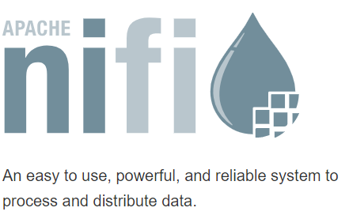

# The Data Set
- Data type: 
  - JSON
  - API through aviationstack.com
  - Free API key for 500 requests per month
  - Gathered data from 'Real Time Flights'

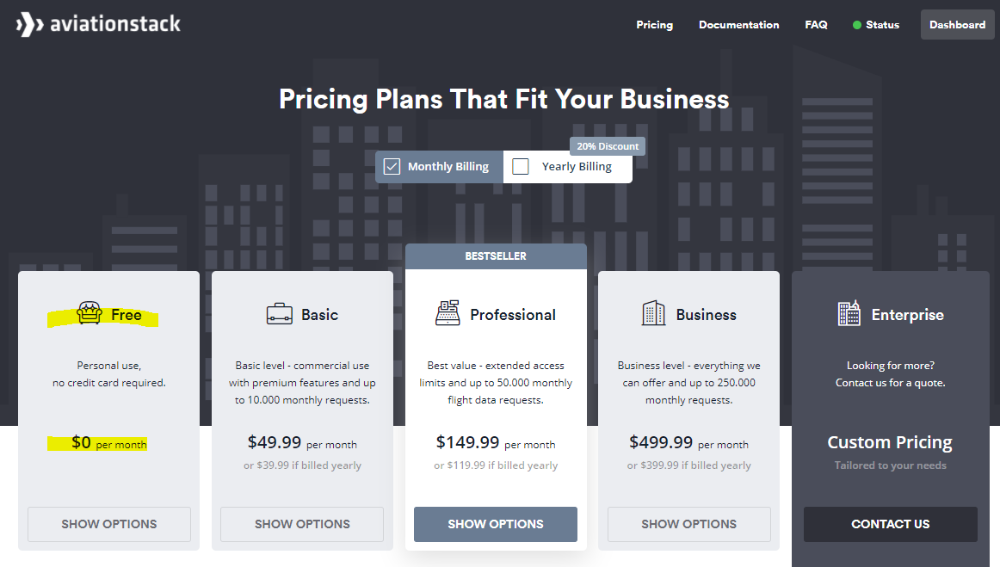

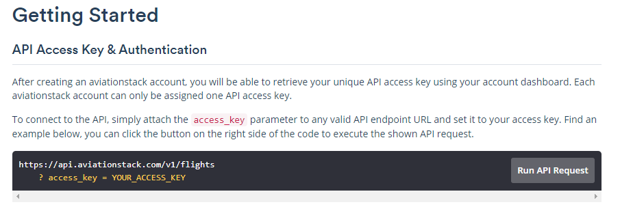

# Used Tools
- Apache NiFi
  - "Apache NiFi supports powerful and scalable directed graphs of data routing, transformation, and system mediation logic."
- How were the tools setup?
  - Java was installed on a new AWS EC2 instance (t2.xlarge), on a Ubuntu OS.
  - Started the service in the terminal using command ./nifi.sh run
  - Loaded the interface in a web browser under localhost:8080/nifi
 
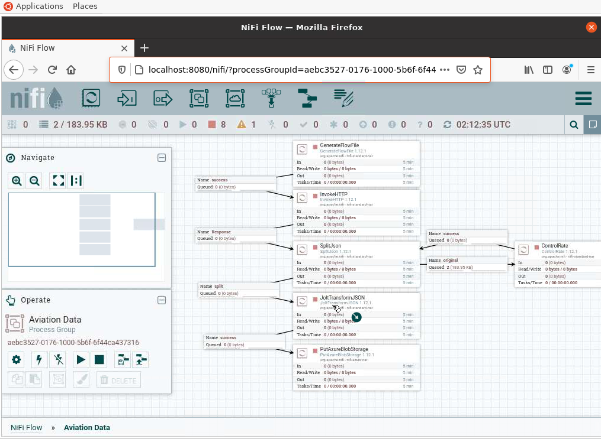

# Processor Design & Data Routing
- InvokeHTTP
  - Pasted the API link in this processor
  - 1 API pull every 10 minutes
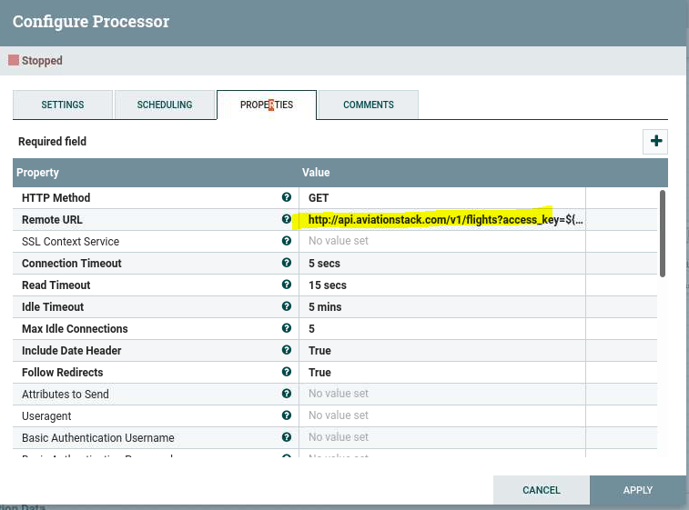
- GenerateFlowFile
  - This is the trigger to start the API call process
  - The access key is pasted in the properties tab
  - The batch size is set to '1'
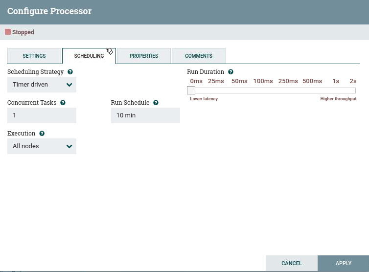
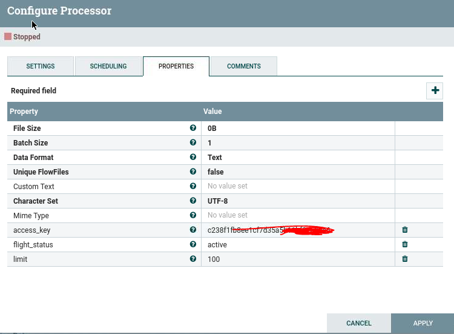

- SplitJson
  - This processor splits a JSON file into multiple files
  - Our goal is to narrow this file down to one specific flight for each JSON file

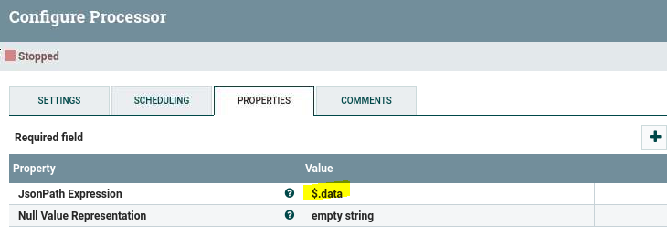

- JoltTransformJson
  - This processor is used to select and transform our data. In the 'Jolt Specification' input (from advanced tab), we paste in our template for how we want to select and organize our data. 
  - For the JSON input we can paste in a specific flight with all the attributes. Press transform, and see the output to make sure it matches our template. 

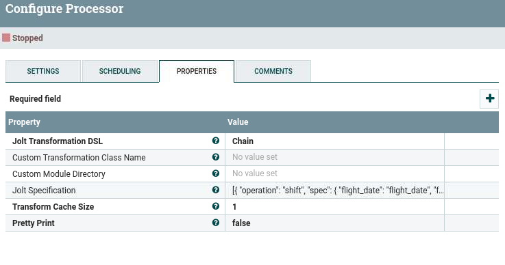
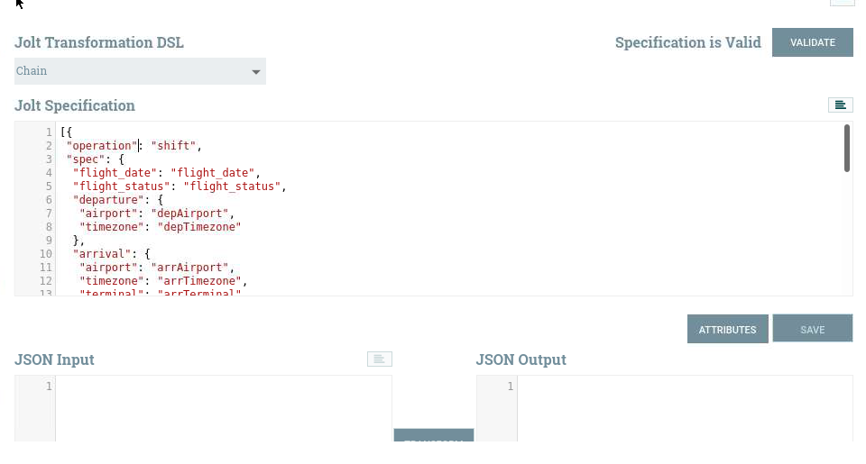

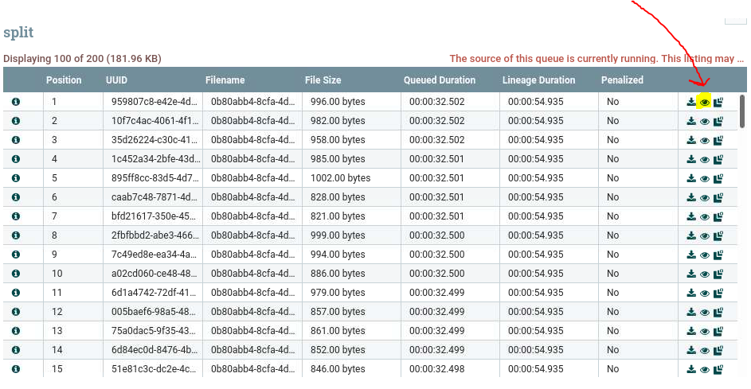
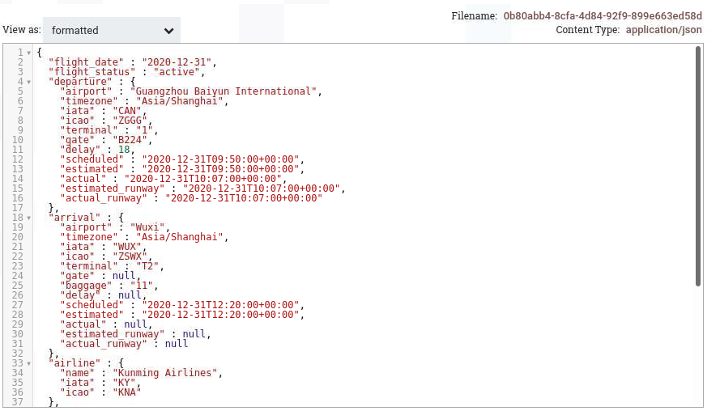
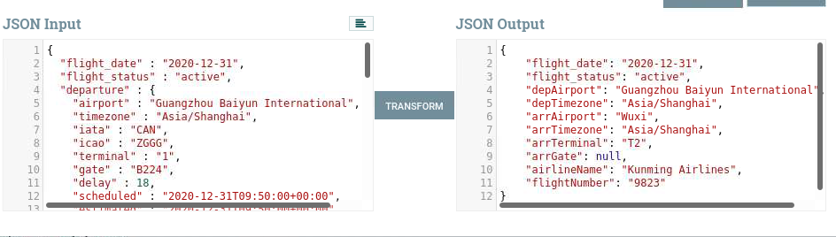

- ControlRate
  - Controls the rate that data is transferred to a processor
  - This helps us save unused data that we trimmed with SplitJSON, due to limited requests per month
  - For our relationship from SplitJson to Control Rate, we select 'original' for the source of data. See the image below.

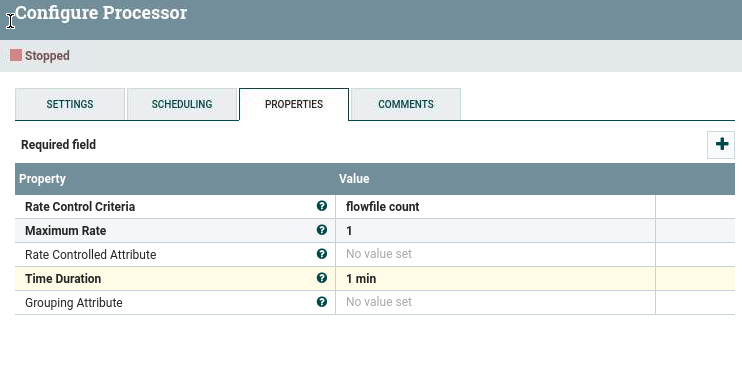
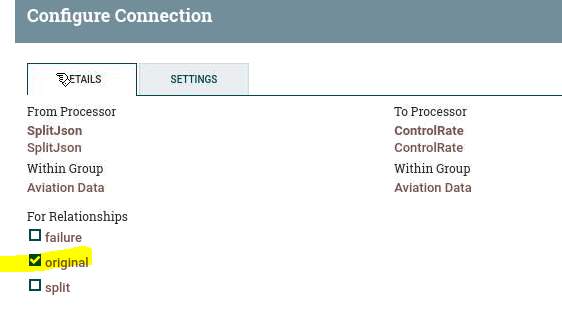

- PutAzureBlobStorage Processor
  - Azure's blob service will be our storage. 
  - We fill in our storage name, container name, data output type, and the SAS token for access.

# Results
- Our JSON file output to the blob storage in one single file. 

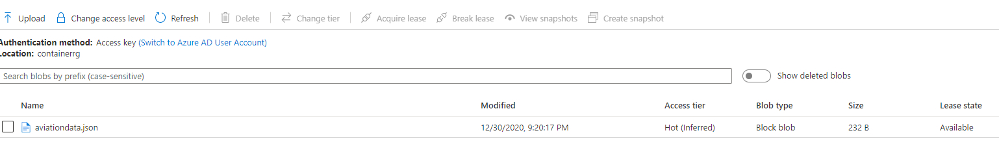

- This is a screenshot of the data:

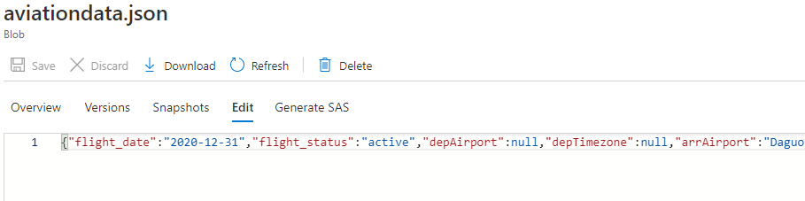

# Conclusion
- Apache NiFi can be a useful tool to extract data, parse the data, and export to a variety of sources.

